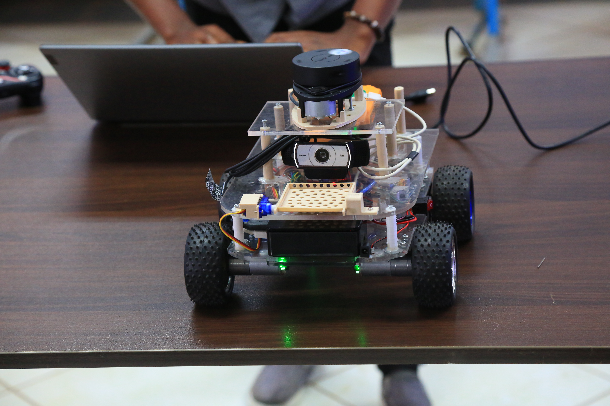
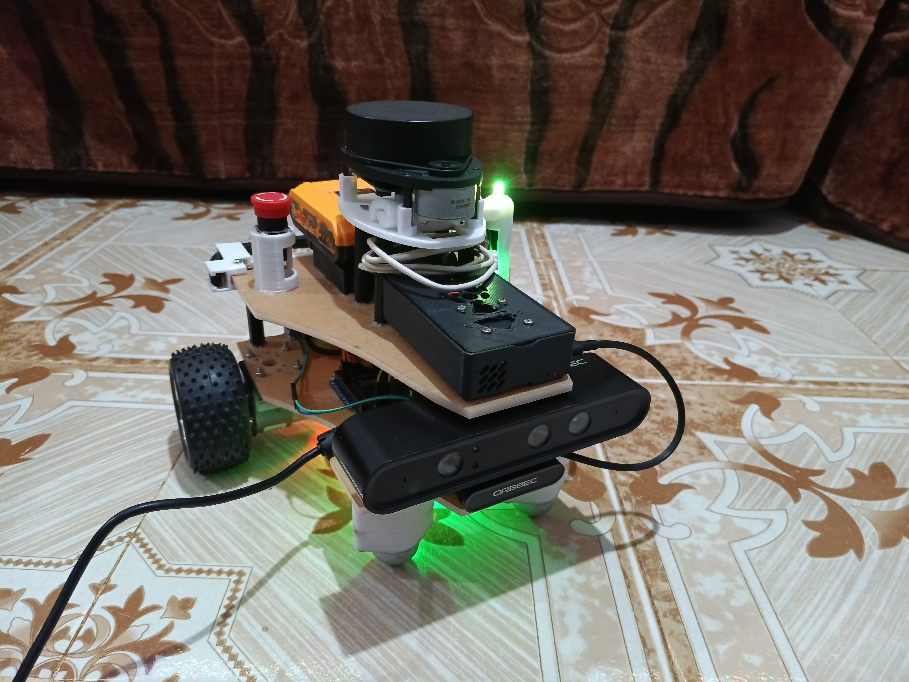
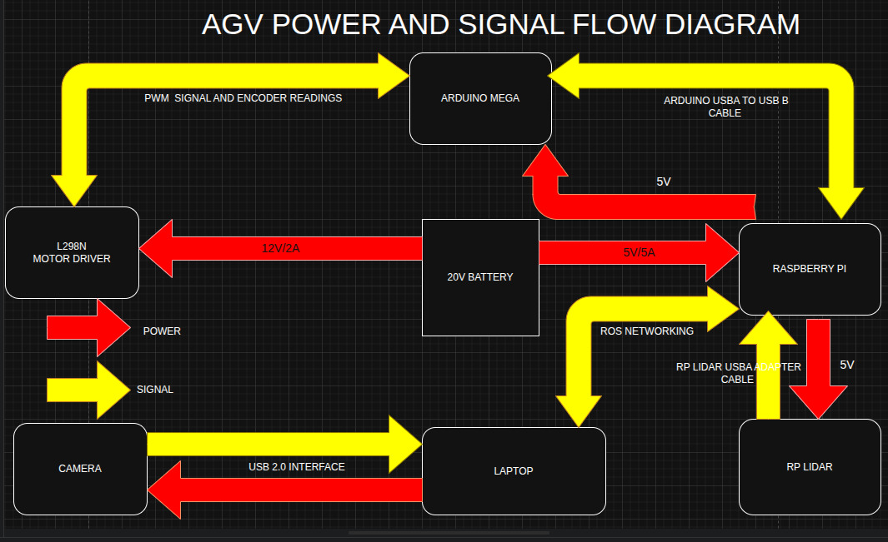
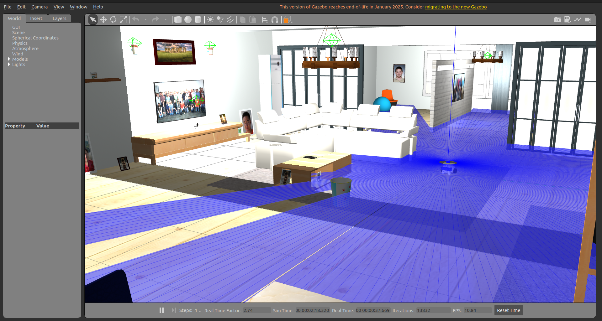
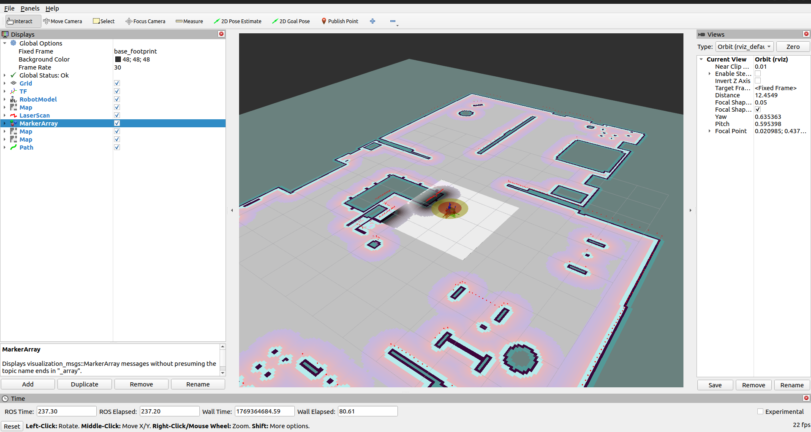
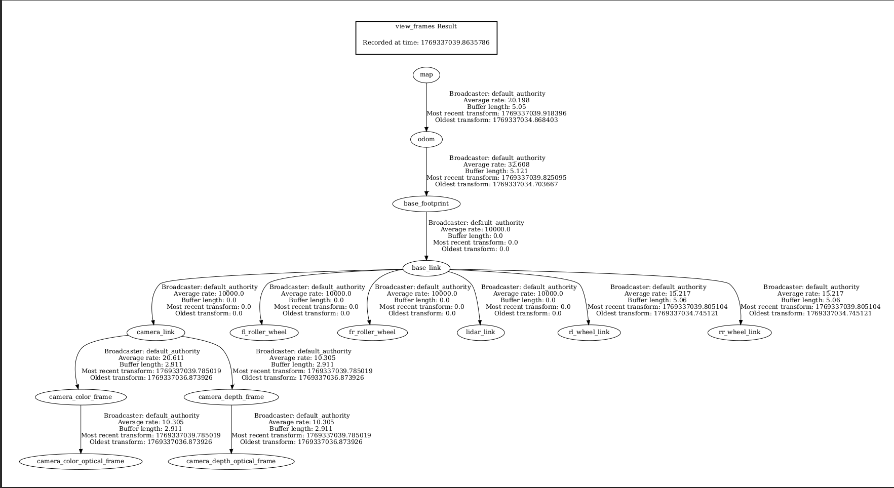
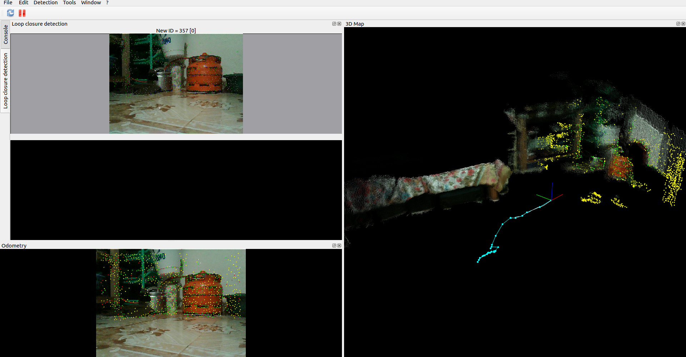
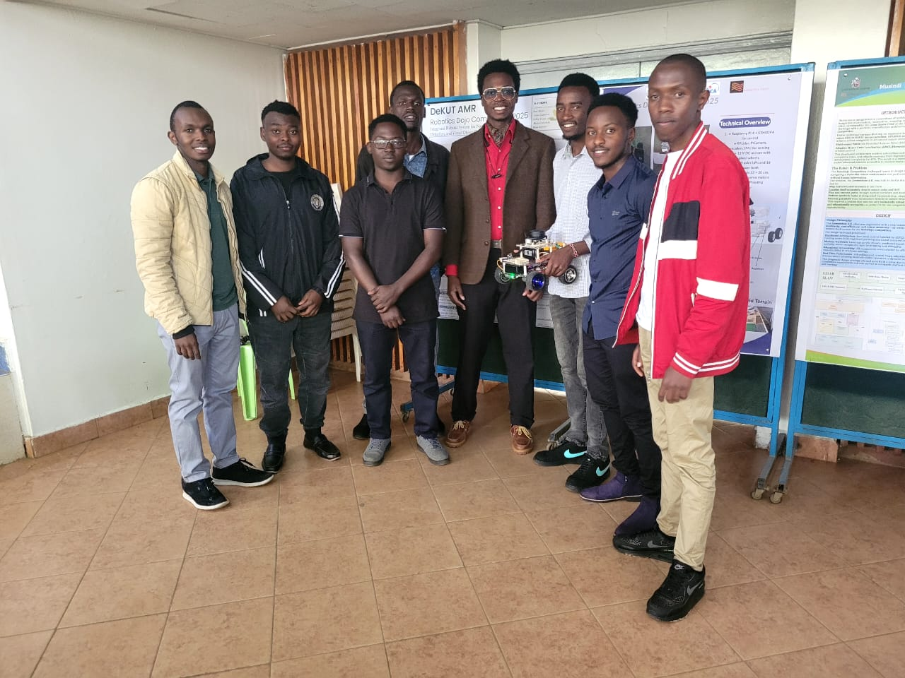

# Project Max

## Table of Contents

1. [Introduction](#introduction)
2. [Robot Variants](#robot-variants)
3. [Project Implementation](#project-implementation)
4. [Getting Started](#getting-started)
5. [Launching Max](#launching-max)
6. [License](#license)
7. [Contributors](#contributors)

---

## Introduction

**Max** is an Autonomous Mobile Robot (AMR) designed for **mapping, localization, and autonomous navigation** using **ROS 2 Humble Hawksbill**.

The project explores both **LiDAR-based SLAM** and **visual SLAM (VSLAM)**, along with real-world robotic tasks such as object detection and agricultural disease detection.

---

## Robot Variants

Two physical versions of Max were developed:

* **Skid-Steer Robot**

  * LiDAR-based SLAM
  * Autonomous navigation using Nav2
  * [Potato disease detection](https://github.com/sierra-95/potato_disease_detection) and Color cube detection using Logitech camera
  * Mechanical loading and offloading mechanism



* **Differential Drive Robot - Beta**

  * LiDAR-based SLAM
  * Visual SLAM (VSLAM) using depth camera
  * Emergency stop button (motor cutoff)
  * Software-based proximity safety: reduces speed as the robot approaches obstacles, with RGB LED indication




---

## Project Implementation

### 1. Hardware Components

* **Raspberry Pi 4** – Main onboard computer
* **RPLidar A1** – 2D LiDAR for SLAM and navigation
* **Orbbec Astra Pro Depth Camera** – Used for VSLAM
* **Logitech C290 USB Camera** – Used for potato disease detection and color cube detection
* **JGB37-520 12V 110 RPM DC Motors (with encoders)**
* **L298N Motor Driver**
* **20V 2A Ingco Drill Battery** – Power source
* **Arduino Mega 2560** – Low-level motor control and encoder processing

---

### 2. Electrical design

### 3. Digital Twin

A **Digital Twin** is a virtual representation of the physical robot and its environment.

In Project Max:

* **Gazebo** was used for physics-based simulation



* **RViz** was used for visualization of:

  * Robot state
  * TF Structure
  * Maps and navigation goals


#### TF tree

---
### 4. SLAM

**Simultaneous Localization and Mapping (SLAM)** is the process of building a map of an unknown environment while simultaneously estimating the robot’s position within that map.

In Max:

* A **2D occupancy grid map** was generated using **LiDAR scans** and **Wheel odometry**, computed from encoder counts
* The resulting map was later used by **Nav2** for autonomous navigation and path planning

---

### 5. Visual SLAM (VSLAM)

**Visual SLAM (VSLAM)** uses camera data instead of (or in addition to) LiDAR.

In this approach:

* A **3D map or point cloud** is built using a **depth camera**.
* Compared to 2D SLAM, VSLAM provides more spatial information

> Note: Although LiDAR–VSLAM sensor fusion is possible, this project used **VSLAM independently** without fusion.



---

## Getting Started

### Clone the Repository

```bash
# Create workspace
mkdir -p max_ws/src && cd max_ws/src

# Clone repository
git clone https://github.com/sierra-95/Max.git
```

---

### Install Dependencies

```bash
# Update ROS dependency database
sudo rosdep update

# Install dependencies
rosdep install --from-paths src --ignore-src -r -y
```

---

### Build the Workspace

```bash
# Checkout the preferred branch
git checkout main

# Build the packages
colcon build --symlink-install
. install/setup.bash
```

---

## Launching Max

### Simulated Robot

```bash
ros2 launch max_bringup max.simulated.launch.py world_name:=small_house
```

---

### Real Robot


#### On the Raspberry Pi

```bash
ros2 launch rplidar_ros rplidar_a1_launch.py serial_port:=/dev/ttyUSB0 serial_baudrate:=115200 frame_id:=lidar_link
```

```bash
#Add the argument `use_rtab:=true` if using VSLAM.
ros2 launch max_bringup max.launch.py
```
#### On the Laptop

```bash
#Add the argument `use_rtab:=true` if using VSLAM.
ros2 launch max_bringup max.launch.py use_master:=true

# If using VSLAM
ros2 launch astra_camera astra_pro.launch.xml
```

---

## License

This project is **open source**.


## Contributors


| Name            | Profile |
|-----------------|---------|
| Michael Machohi | [sierra-95](https://github.com/sierra-95) |
| Paul Migwi      | [Paul-Migwi](https://github.com/Paul-Migwi) |
| James Gathirwa  | [gathirwa011a](https://www.linkedin.com/in/gathirwa011a) |
| Brian Kiprono   | [Kiprono1385](https://github.com/Kiprono1385) |
| Moses Mwangi   | [moses-kangethe](https://www.linkedin.com/in/moses-kangethe) |
| Zebby Akach     | [ZEBAYA](https://github.com/ZEBAYA) |

---
